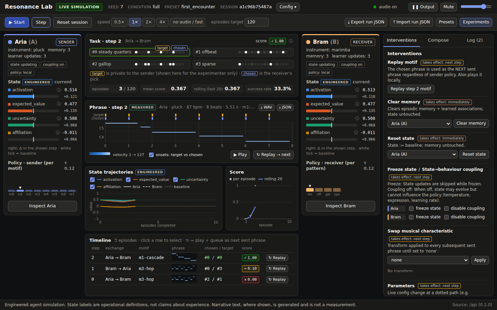

# Resonance Lab Manual

A plain-language guide for someone who has never opened the lab before. A hosted copy of this manual with an
interactive chart is at https://claude.ai/code/artifact/70bc6894-73ce-4c90-aaef-1f75a91b4245.

## What this is, in one minute

Resonance Lab is a small game played by two software agents, Aria and Bram, who can only talk to each other with
short tunes. You watch, listen, and poke at them.

Think of it like this. Two people sit back to back. One of them (the *sender*) is shown a secret card with a rhythm
on it, say "steady quarters" or "gallop". They are not allowed to speak. They may only hum a short tune. The other
person (the *receiver*) hears the tune and guesses which rhythm card it was. Both get a score: 1.0 for a correct
guess, a little partial credit for a near miss, 0 for a clear miss. Then they swap roles and play again, hundreds of
times.

Neither agent starts with a rulebook. They have to invent one together. The sender learns which tune works for
which card; the receiver learns which sounds point to which card. This is called a signalling game, and it is well
known that simple learners can settle on a shared code, or get stuck on a half-working one. Both outcomes happen
here, depending on the random seed.

On top of the game, each agent carries a small **internal state**: four numbers that drift as the agent plays,
remember recent events, and can tip its choices. The research question of the lab is narrow and testable: does an
agent's behaviour come to depend on its *history* of musical exchanges, beyond what a plain stimulus and response
rule would predict? Everything in the app exists so you can see whether that is happening, and whether the music
itself matters or an arbitrary signal would do as well.

What it is not: nobody here claims the agents feel anything. The four state numbers are engineered quantities with
definitions you can read on the screen. The equations that move them were written by hand, the learning rule is a
simple one, and the app labels what is measured, what is engineered, and what is generated text. When the lab shows
a result, it is a statement about those mechanisms and nothing more.

## Two ways to open it

The quickest way is the hosted demo: https://claude.ai/artifact/5T3kn2pv9JD2niFbo4ieX6. It runs entirely in your
browser, needs nothing installed, and is the best place to learn the screen. Use a laptop or desktop; the layout
needs about 1,000 pixels of width.

The full version runs on your own computer and is what the research results in this manual come from. It has the
Python simulation, the batch experiment runner, the exported run files, and the optional local language model.
The section "Installing the full version" covers the install.

| | Hosted demo | Full version |
| --- | --- | --- |
| Badge in the header | DEMO DATA (mock) | LIVE SIMULATION |
| Where the agents run | In your browser (a TypeScript copy of the simulation) | In a Python server on your machine |
| Sound, stepping, interventions, inspector, presets | Yes | Yes |
| Batch experiments over many seeds | Yes, in the browser, smaller runs | Yes, including the full six-condition batch and CSV export |
| Export and import run files | Import works; the download buttons do nothing in the hosted page | Yes |
| Optional language model helper | No | Yes, after a one-time download |
| Numbers match the experiment report | No, the demo uses its own learning settings | Yes |

In both versions the badge next to the title always tells you which one you are looking at, and a third badge,
REPLAY, appears when you load a saved run instead of computing a new one.

## Your first ten minutes

Follow these steps once and the rest of the screen will make sense.

1. Click **Enable audio** at the top right. Browsers refuse to play sound until you click something, so the lab
   asks for one click. The indicator changes from "audio locked" to "audio on".
2. On the start screen, find **First encounter** and click **Start live session**. This is the plainest setup:
   two fresh agents, no history, 120 rounds to play.
3. Click **Step** once. One round happens. Look at the task card in the middle: one rhythm is tagged *target*
   (that is the secret card the sender saw) and one is tagged *chosen* (the receiver's guess). The score chip
   shows how they did. Below it, the piano roll shows the tune that was played, and you heard it.
4. Click **Step** a few more times. Notice the two agents swap roles each round (the SENDER and RECEIVER labels
   move), and the four state bars in each agent panel shift a little each time.
5. Click **▶ Start**. The lab now plays round after round on its own, waiting for each tune to finish before the
   next. The score plot fills in. Let it run for a minute, then click **Pause**.
6. Click **Inspect Aria**. A drawer opens on the right. It shows, for the selected round, the state numbers before
   and after, what pushed them, which rhythm the agent considered likely, and exactly what information it
   received. Close it with the × in the corner.
7. Open the **Interventions** tab on the right. Click **Clear memory** with Aria selected. Watch Aria's memory
   count drop to 0 while the state bars stay where they were. That difference, memory gone but state untouched,
   is the point of having two separate reset buttons.
8. Switch the speed to **no audio / fast** and press **Start** again. Rounds now run in batches without sound.
   Watch the rolling score. If the agents are finding a shared code, it climbs above the chance level of about
   0.33. If they are stuck, it hovers. Both are real outcomes.
9. In the timeline at the bottom, click **↻ Replay** on any earlier row. The tune plays again and is queued to be
   the next message, so you can see how the receiver reacts to a tune it has heard before.
10. Click **Experiments** at the top right, leave all six conditions ticked, and click **Run experiment**. After
    a few seconds you get the comparison chart that the experiments section explains.

If anything feels off, the troubleshooting section has the fixes for the common cases.

## The screen, panel by panel



The layout is the same in the hosted demo and the full version. Reading it left to right and top to bottom:

| Area | What it shows | What to look at |
| --- | --- | --- |
| Header | App name, the data-source badge, seed, condition, preset, session id, a Config popover, and the audio controls (Output pause, Mute, volume) | The badge: LIVE, REPLAY or DEMO |
| Controls bar | Start/Pause, Step, Reset session, speed buttons, the episodes target, Export and Import, Presets, Experiments | Step for one round at a time; "no audio / fast" for long runs |
| Aria panel (left) and Bram panel (right) | Each agent's name, instrument, role this round, memory count, learner update count, flags, the four state bars with current value and last change, a small bar chart of the agent's current choice probabilities, and an Inspect button | The state bars and the little deltas under them |
| Task card (centre top) | The four rhythm cards drawn as dot grids, the *target* tag, the *chosen* tag, the score chip, and running numbers: episodes, mean score, rolling score over the last 20 rounds, success rate | Whether chosen and target match, and the rolling score |
| Phrase (centre) | A piano roll of the tune just played: pitch up the side, beats along the bottom, bars coloured by loudness, with the instrument, tempo and length. Buttons: WAV, JSON, Play, Replay → next | Hear it with Play; compare tunes between rounds |
| State trajectories (centre) | A line chart of the four state values over rounds for both agents. Aria solid, Bram dashed, baseline dotted, vertical lines where you intervened | Whether lines return toward the baseline after a jolt |
| Score (centre) | Per-round score dots and a rolling average line | A climbing line means a shared code is forming |
| Timeline (bottom) | One row per round: who sent to whom, which motif, a thumbnail of the tune, chosen vs target, the score, and a Replay button. Interventions appear as marker rows with "effective from step N" | Click a row to load that round into the piano roll and inspector |
| Right sidebar tabs | Interventions, Compose, Log (every event in plain text) | |
| Footer | A fixed reminder that this is an engineered simulation and that state labels are definitions, not claims about experience | |

Two small labels appear throughout: **MEASURED** on anything computed from the tune itself, and **ENGINEERED** on
the state and learning values. A third, **GENERATED**, appears only when the optional language model writes text,
and it marks that text as commentary, not data.

## The words on the screen

The four state bars are the heart of the lab, so start there. Each is a number that moves a little every round, is
pulled gently back toward a resting value, and can never leave its range. The names are shorthand for the rules
below, nothing more.

| State bar | Range, rest value | What moves it | What it does when coupling is on |
| --- | --- | --- | --- |
| activation | 0 to 1, rests at 0.5 | Up when the agent hears a dense or loud tune (a hand-written rule you can switch off), up after a better-than-expected score, down after a worse one | High activation makes the agent play faster and louder and pick its most-likely option more decisively |
| expected_value | 0 to 1, rests at 0.5 | Tracks the recent scores, like a running average | Nothing directly; it is the yardstick that produces surprises |
| uncertainty | 0 to 1, rests at 0.5 | Up when scores keep surprising the agent, down when they are predictable | High uncertainty makes the agent explore more, trying less-likely options |
| affiliation | −1 to 1, rests at 0 | Up with shared successes, down with shared failures, a small nudge up when the partner's tune resembles the agent's own | High affiliation makes the agent learn faster from each round |

Other words you will meet:

- **Score.** 1.0 for the exact rhythm, up to 0.5 for a near miss (how many beats overlap), 0 otherwise. Chance is
  about 0.33 because near misses earn a little.
- **Target.** The secret rhythm the sender saw. Shown to you, never to the receiver. The inspector proves this each round.
- **Chosen.** The receiver's guess.
- **Motif.** One of eight short tune templates (m0 to m7, with names like cascade and hop) the sender can pick
  from. Every tune played is one of these, with small variations in timing and loudness.
- **Phrase.** The actual tune played this round: a list of notes with pitch, start time, length and loudness, at a
  tempo, on an instrument.
- **Features.** Numbers computed from the notes: how many notes per second, how regular the rhythm is, whether the
  pitch rises or falls, how varied the loudness is, and so on. This is what the receiver actually reads. It never
  hears audio; it reads these numbers.
- **Temperature (τ).** How adventurous a choice is. Low temperature means "take the best option"; high means
  "spread your bets". The base value comes from the config; the state bars can raise or lower it.
- **Coupling.** The switch that lets the state bars influence behaviour at all. With coupling off the bars still
  move but change nothing.
- **Memory.** A list of the agent's recent rounds: what it heard, what it chose, what it scored. Capped at 200 entries.
- **Learned associations.** The weights the agent has built up: for the receiver, which tune features point to
  which rhythm; for the sender, which motif has worked for which target.
- **Seed.** The starting point for the random numbers. The same seed with the same settings gives the same run, every time.
- **Condition.** Which version of the rules is in force. The normal one is called *full*; the others switch
  something off so you can measure what it was doing.
- **Episode, step, round.** The same thing: one exchange of a tune and a guess.

## Interventions: poking the agents

The Interventions tab is where the lab becomes an experiment rather than a screensaver. Every button logs an event
in the timeline with the round it takes effect, so you can always see what you did and when.

| Button | What it does | Takes effect | What to watch for |
| --- | --- | --- | --- |
| Replay motif | Plays the selected tune again and makes it the next message, overriding whatever the sender would have picked | Next round | How the receiver reacts to a tune it has heard before, in the policy bars and the inspector |
| Clear memory (pick an agent) | Erases that agent's remembered rounds and its learned associations. The state bars are left exactly where they are | Immediately | Memory count drops to 0; the agent's guesses go back to being spread out; the state bars do not jump |
| Reset state (pick an agent) | Puts the four state bars back to their resting values. Memory and learned associations are kept | Immediately | Bars snap to the baseline; the agent still guesses as well as before |
| freeze state (tick per agent) | Stops the state bars from moving at all | Next round | Flat lines in the trajectory chart; the inspector reports "frozen: yes" |
| disable coupling (tick per agent) | The bars keep moving but are no longer allowed to change behaviour: temperature goes back to its base, tempo and loudness are no longer scaled, learning rate is unscaled | Next round | In the inspector, "τ base → effective" shows two equal numbers and "coupling: off" |
| Swap musical characteristic | Applies a transform to every tune from now on: transpose (shift all pitches up), velocity_flatten (same loudness everywhere), tempo_shift (play faster), contour_invert (flip the melody upside down), rhythm_shuffle (scramble the timing), pitch_shuffle (scramble the note order). Choose "none" to stop | Next round | Whether the score drops. Transpose and velocity changes keep the message intact; the shuffles damage it |
| Parameters | Sliders for state decay and per-agent sensitivity, applied live to the running session | Next round | Faster decay means a jolt fades in fewer rounds |

The pair worth trying first is Clear memory and Reset state on the same agent, a few rounds apart. They look
similar on the button but do opposite things: one forgets the past and keeps the state numbers, the other keeps the
past and resets the state numbers. The inspector makes the difference visible.

## Reading the Inspector

The inspector is the lab's microscope. Click **Inspect Aria** or **Inspect Bram**, pick a round in the timeline,
and read the drawer top to bottom. Every number in it comes from the simulation; nothing is summarised or
interpreted for you.

1. **State before → after.** The four values at the start and end of that round, with the change.
2. **Inputs that caused it.** The ingredients of that change: the *music drive* (tagged HAND-AUTHORED, because it
   is a rule someone wrote, not something learned), the *prediction error* (the score minus what the agent
   expected), the *outcome* (the score itself), the *partner similarity* (how much the partner's tune resembled
   the agent's own), whether decay was applied, and whether the state was frozen. If you turned off the acoustic
   rule in the config, the music drive reads zero and says so.
3. **Policy: scores → probabilities.** The agent's shortlist. For a receiver, one row per rhythm with the score
   the agent expects from guessing it and the probability it actually assigned; the chosen row is highlighted.
   For a sender, one row per motif. Above the table: the role, whether the choice came from the local rules or a
   language model, the base temperature and the effective temperature after the state bars adjusted it, and
   whether coupling was on. Below it: the tempo and loudness adjustment that activation applied to the sender's
   performance.
4. **Retrieved memories.** The stored rounds most similar to the tune just heard, with their similarity, what was
   chosen then, and what it scored. In the current version these are shown for you to inspect; they do not yet
   feed into the choice, which is the first item on the list of next experiments.
5. **Learned associations.** For the receiver, a grid of weights: one row per rhythm, one column per tune
   feature. A strongly positive cell means "this feature makes me expect a good score from this rhythm". For the
   sender, a table of expected scores by target and motif. Watch these grow from zero over a session; after Clear
   memory they go back to zero.
6. **Information actually received.** The exact package the receiver got: the channel (music or symbol), the
   sender, the round, and the full list of tune features with their values. A green line confirms that no target
   field was in it. This panel is the lab's proof that the receiver cannot cheat.
7. **Model request / response** (only when a language model is enabled). The prompt that was sent, what came
   back, how long it took, and the input type, which is always a text summary of features, never audio. It is
   tagged GENERATED.

The inspector refreshes as the session runs, so you can leave it open and step.

## The three presets

A preset is a ready-made setup with a question attached. Each card on the start screen has two buttons: **Start
live session** opens it in the lab so you can watch and intervene, and **Run preset comparison** runs it to the
end without sound and shows the measured comparison as a table.

| Preset | What is set up | The question | What would count as a yes |
| --- | --- | --- | --- |
| First encounter | Two fresh agents, 120 rounds, all mechanisms on | Can two agents with no shared past invent a working code from nothing? | The score over the last fifth of the run is clearly above the first fifth and above the chance level of 0.33. A flat line means no code formed in this run, which happens with some seeds |
| Shared history vs memory reset | Agents play 120 rounds together. Then the receiver hears a tune it has met many times before. A copy of that receiver has its memory wiped and hears the identical tune, with the same state values and the same random draw | Does the past change how a familiar tune is treated? | The two copies spread their guesses differently. In the recorded run at seed 7 the experienced receiver's guesses were more concentrated (entropy 1.11 against 1.39), though its top guess was not the right one. The effect is history dependence, not correctness |
| Same phrase, different history | Two receivers are trained separately. For one, a particular tune is always followed by rhythm 2, so the tune becomes a reliable clue. For the other, the same tune is followed by random rhythms, so it is useless. Then both hear that tune with identical state values and random draw | Does the same input produce different behaviour and a different state response after different histories? | A large gap in the probability given to rhythm 2 (0.999 against 0.26 in the recorded run) and opposite activation responses. This result is **constructed**: the training schedule is designed to produce it. It demonstrates the mechanism; it is not a discovery |

## Experiments and the six conditions

Watching one session tells you what happened once. To learn what *causes* it, the lab runs the same game many
times with one thing switched off at a time and compares. The **Experiments** button does this without sound: you
pick conditions, type a list of seeds, set the number of rounds, and press **Run experiment**.

A *condition* is a version of the rules. A *control* is a condition that removes one ingredient so that you can
see what that ingredient was contributing. The lab has six:

| Condition | What is switched off | If scores fall compared with full, it shows… |
| --- | --- | --- |
| full | Nothing. This is the reference | — |
| no_history | Learning and memory. The agents never improve | …that learning from past rounds is what makes the code form |
| state_fixed | The state bars are nailed to their rest values | …that a moving state changes outcomes at all |
| state_decoupled | The bars move but may not influence behaviour | …that the state-to-behaviour link matters, separately from the bars moving |
| symbol | The tune. The receiver gets a plain label saying which motif was sent, with no sound-like qualities | …that music carries something a bare label does not. If scores *rise*, a label is simply easier to decode |
| perturbed (choose a kind) | The tune is altered in the channel before the receiver gets it | …whether that alteration damaged the message. Transpose, flatten and tempo changes should be harmless; the shuffles should hurt |

Two rules for reading the results honestly. First, the unit of comparison is a whole run (one seed), not a single
round, because rounds within a run depend on each other. That is why the lab asks for several seeds and shows every
run as its own dot. Second, a control that does as well as or better than *full* is a real result, not a mistake;
the chart shows it as it is.

**Reading the chart.** Each condition gets a row. The dots are individual runs, the bar is the mean, and the line
through it is one standard deviation. If two rows' lines overlap heavily, the conditions are not distinguishable
with this many seeds. Below the dot chart, the learning curves show the mean score in ten blocks of rounds with a
shaded band for the spread; a curve that rises is learning, a flat one at 0.33 is chance. The CSV and JSON buttons
download everything, one row per run.

## What the results say so far

The agents learn a shared code, the tunes work as a channel, and the extra machinery (moving state, coupling,
memory) did not make them better at the task. The six-condition batch from the full version (last 20 % of 120
rounds, 10 seeds per condition, mean ± one standard deviation across runs; chance is 0.33):

| Condition | Final-block score |
| --- | --- |
| full (everything on) | 0.61 ± 0.15 |
| no_history (no learning) | 0.31 ± 0.05 |
| state_fixed | 0.64 ± 0.12 |
| state_decoupled | 0.64 ± 0.12 |
| symbol (arbitrary label) | 0.60 ± 0.10 |
| perturbed: transpose | 0.63 ± 0.11 |
| perturbed: rhythm_shuffle | 0.62 ± 0.14 |

The one row that stands apart is no_history: without learning the agents stay at chance. Every other row sits
around 0.6 with wide, overlapping spreads, so none of those conditions can be told apart with ten seeds.

In plain words:

- **Learning is real and uneven.** The full condition climbs from about 0.33 to about 0.61, but individual runs
  range from 0.44 to 0.81. Some pairs of agents find a clean code, some settle on a half-working one where two
  rhythms share a tune. Both are normal for this kind of game.
- **A plain label does the job as well as music.** The symbol control matched full at 120 rounds and beat it at
  300 rounds (0.83 against 0.77). A label that says exactly which motif was sent is at least as easy to decode as
  a tune, and it is immune to the sender's expressive variations. So, on this task, the music is not carrying
  extra information; what it adds is graded similarity between tunes and a path into the state bars.
- **The state bars cost a little rather than helping.** Switching off each coupling path one at a time (acoustic
  rule, affiliation-to-learning-rate, expressive tempo and loudness, temperature) each gave a slightly higher or
  equal score. The state demonstrably changes *how* the agent chooses, which the inspector shows, but on this
  task that influence is not useful.
- **Only scrambling the notes damages communication.** Transposing, flattening loudness and changing tempo left
  scores unchanged. Shuffling the pitch order was the one clearly harmful change (0.57). That is a communication
  effect and says nothing about state.
- **History dependence shows where it was built to show.** The constructed preset gives a 0.999 against 0.26
  difference in how the same tune is treated after different histories. The shared-history preset shows the
  experienced receiver concentrating its guesses more than a memory-wiped copy, though not on the right answer.
- **Familiar and transposed tunes are treated alike.** The receiver generalises well to shifted versions of tunes
  it knows, and its confidence does not change between a familiar tune and a transformed one. Memory is recorded
  and shown, but it does not yet take part in the decision.

So the research hypothesis is partly supported: behaviour clearly depends on interaction history through learning,
and the engineered state demonstrably affects the choice mechanism. What has not been shown is that the state or
the musical form of the message produces behaviour an arbitrary signal could not. The next experiments in
[EXPERIMENT_REPORT.md](EXPERIMENT_REPORT.md) are chosen to test exactly that.

## Playing a tune yourself

The **Compose** tab lets you take the sender's seat. You pick a target rhythm, write a short tune, and see whether
the receiver guesses right. It is the most direct way to feel what the receiver can and cannot read.

1. Open **Compose** in the right sidebar.
2. Click keys on the small keyboard, or click cells in the grid, to place notes. Each cell is a beat position; the
   row is the pitch. The velocity buttons set how hard the next notes are struck, the length buttons how long they
   last, and **Clear** empties the grid. You can also pick the scale and the instrument.
3. Press **▶ Preview** to hear it. Keep it to roughly 2 to 8 seconds, like the agents' own tunes.
4. Choose a target rhythm from the dropdown, or leave it on "drawn by environment" to let the lab pick in secret.
5. Press **Send as human**. One round runs with your tune as the message. The timeline row is marked *human*, the
   receiver's guess and the score appear on the task card, and the receiver learns from the round like any other.
   The agent who would have sent is skipped for that round.
6. **Save motif** stores the tune under a name so you can reuse it later from the **Load saved…** dropdown or
   replay it as an intervention. **⤓ JSON** downloads the notes as a file.

Things worth trying: send the same tune five times with the same target and watch the receiver's probability for
that rhythm grow in its panel; then send it with a different target and watch it unlearn. Or copy one of the eight
motifs by ear and see whether the receiver treats your imitation like the original. The receiver reads features
such as note density, rhythm regularity and melodic direction, so a tune with the same shape in a different key
usually lands the same way.

## Installing the full version

You need three things on your computer: Python 3.11 or newer, Node.js 22 or newer, and Git. On a Mac, install
them with Homebrew (`brew install python node git`); on Windows, use the installers from python.org and nodejs.org,
then run the commands below in Git Bash or WSL; on Linux, use your package manager.

Then, in a terminal:

```
git clone -b claude/epic-wright-mvx880 https://github.com/hdxsfbr/resonance-lab
cd resonance-lab
./start.sh
```

The first start takes a few minutes: it creates a private Python environment, installs the packages, and builds
the web app. When it prints `Resonance Lab -> http://localhost:8000`, open that address in your browser. The badge
in the header should read LIVE SIMULATION. Later starts take a few seconds.

To stop it, press Ctrl+C in the terminal. Your sessions, saved motifs and experiment results are kept in
`data/resonance.db`, and the run exports from the build session are in `data/exports/`.

Useful extras once it runs:

- `make experiments` runs the full six-condition batch over ten seeds without the browser and writes JSON and CSV
  files into `data/exports/`.
- `make test` runs the automated checks (144 on the simulation side, 28 on the web side).
- The settings that shape every run are in `config/default.yaml`. Each run records the settings it used, so
  changing the file never silently alters an old result.

The optional language-model helper is off by default. It lets a small local model choose the receiver's rhythm
instead of the built-in rules, and it needs a one-time 500 MB download. The steps are in
[MODEL_SETUP.md](MODEL_SETUP.md). Two things to know before you bother: the bundled model is small and makes poor
choices, and it only ever reads a text summary of the tune's features, never audio.

## Troubleshooting

| What you see | Why | What to do |
| --- | --- | --- |
| No sound, indicator says "audio locked" | The browser blocks sound until you click something | Click **Enable audio** once. If it still says locked, check the tab is not muted and the volume slider is up |
| Sound but no notes, or very quiet | Volume slider low, or the Output button is paused | Raise the slider; make sure Output shows the pause glyph rather than play |
| Badge says DEMO DATA in the full version | The web page could not reach the Python server | Make sure `./start.sh` is still running in the terminal and you opened http://localhost:8000, not a file. Reload the page |
| The Export buttons do nothing | You are on the hosted demo page, where downloads are blocked | Use the full version for exports; import still works on the hosted page |
| Steps are slow at 1× | At 1× the lab waits for each tune to finish before the next round, by design | Use 2×, 4×, or "no audio / fast" for long runs |
| The score never climbs | Some seeds settle on a poor code; also, 60 rounds is often too few | Run to 120 or more rounds; try another seed from the start screen; compare several seeds in Experiments rather than judging one run |
| state_fixed and state_decoupled give identical numbers | Expected. The state can only affect behaviour through coupling, so holding it still or cutting the link produces the same choices | Nothing; the two differ only in whether the bars move on screen |
| The symbol control scores higher than full | Expected and reported as-is. A label is at least as easy to decode as a tune | See the results section |
| An intervention seems to do nothing | Most take effect on the next round, not the current one | Press Step once and look for the marker row in the timeline |
| Reset session asks nothing and starts over | By design; it rebuilds the same seed and settings | Use Export first if you want to keep the run |
| The page looks cramped or scrolls sideways | The lab is designed for screens about 1,000 pixels wide or more | Use a laptop or desktop window; zoom the browser out slightly if needed |
| A language-model round takes 10 seconds or more | The bundled local model runs on your CPU | Normal; lower the call budget in the config, or leave the model off |

## Glossary

- **Activation.** State bar, 0 to 1. Rises with dense or loud tunes (a hand-written rule) and with better-than-expected scores; falls with worse ones; drifts back to 0.5.
- **Affiliation.** State bar, −1 to 1. Rises with shared success, falls with shared failure; scales how fast the agent learns when coupling is on.
- **Agent.** One of the two players, Aria (A) or Bram (B). Each has a state, a memory, two learners and a policy.
- **Baseline.** The resting value a state bar drifts back toward.
- **Chance.** The score a receiver would get by guessing at random: about 0.33 with partial credit.
- **Condition.** A named version of the rules used for an experiment: full, no_history, state_fixed, state_decoupled, symbol, perturbed.
- **Control.** A condition that removes one ingredient to measure its contribution.
- **Coupling.** Whether the state bars are allowed to influence behaviour.
- **Decay.** How strongly a state bar is pulled back to its baseline each round. Adjustable in the Parameters sliders.
- **Engineered.** A label on anything that is a designed quantity or rule rather than a measurement: the state bars, the learners, the coupling.
- **Episode, round, step.** One exchange: a target, a tune, a guess, a score.
- **Expected value.** State bar, 0 to 1. A running average of recent scores.
- **Features.** Numbers computed from a tune's notes (density, regularity, direction, loudness variation, and more). What the receiver actually reads.
- **Generated.** A label on text written by the optional language model. Commentary, never data.
- **Inertia.** How much of a state bar's previous value carries over each round; higher inertia means slower change.
- **Learner.** The part of an agent that updates its learned associations after each score. The receiver has one over tune features; the sender has one over motifs.
- **Measured.** A label on anything computed from the tune itself, either from its notes or from the rendered sound.
- **Memory.** The agent's list of recent rounds: what it heard, chose and scored. Shown in the inspector; not yet used in decisions.
- **Motif.** One of eight short tune templates the sender chooses between.
- **Partial credit.** Up to half a point for a guessed rhythm that shares beats with the target.
- **Perturbation.** A transform applied to tunes in the channel: transpose, velocity_flatten, tempo_shift, contour_invert, rhythm_shuffle, pitch_shuffle.
- **Phrase.** The actual tune played in a round: notes, tempo, instrument.
- **Policy.** The rule that turns the agent's expectations and state into a choice. Shown as scores and probabilities in the inspector.
- **Preset.** A ready-made session with a question attached: First encounter, Shared history, Same phrase different history.
- **Receiver.** The agent that hears the tune and guesses the rhythm.
- **Replay.** Either hearing a tune again (audio only) or feeding it back to the receiver as the next message (intervention). The timeline button does both. Also the badge shown when a saved run is being played back.
- **Seed.** The starting number for all randomness. Same seed and settings, same run.
- **Sender.** The agent that sees the target and plays a tune.
- **Symbol.** The control where the receiver gets a plain label of which motif was sent instead of a tune.
- **Target.** The secret rhythm the sender must communicate. Visible to you, never to the receiver.
- **Temperature (τ).** How spread out the agent's choice is. Low: always the top option. High: more exploration.
- **Timing pattern.** One of the four rhythm cards: steady quarters, offbeat, gallop, sparse.
- **Uncertainty.** State bar, 0 to 1. Tracks how surprising recent scores have been; raises temperature when coupling is on.
